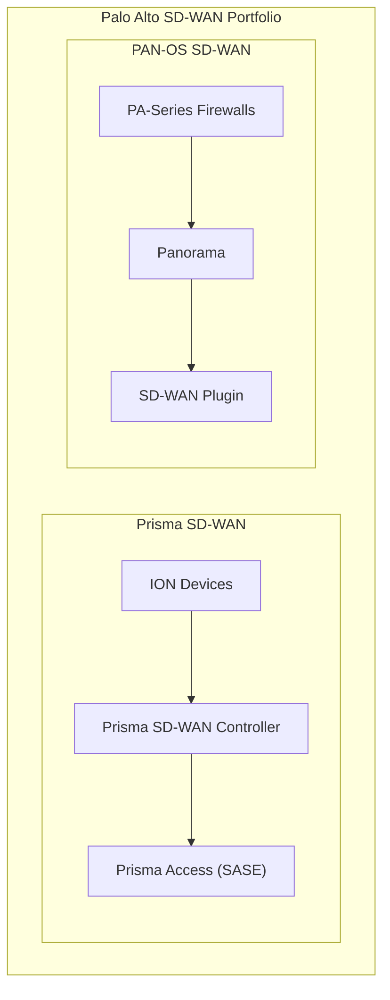

# :material-shield-half-full: Palo Alto SD-WAN

Palo Alto Networks offers two distinct SD-WAN solutions: **Prisma SD-WAN** (formerly CloudGenix) for cloud-managed SD-WAN, and **PAN-OS SD-WAN** built into PA-Series next-generation firewalls managed by Panorama.

## Two Products, One Ecosystem

## When to Use Which

| Feature | Prisma SD-WAN (CloudGenix) | PAN-OS SD-WAN |
|---------|---------------------------|---------------|
| **Form factor** | Dedicated ION appliances | PA-Series firewalls |
| **Management** | Cloud-native controller | Panorama on-prem/cloud |
| **Best for** | SD-WAN-first deployments | Existing Palo Alto NGFW customers |
| **SASE integration** | Native Prisma Access | Via GlobalProtect + Prisma Access |
| **Deployment model** | Overlay-only (thin branch) | Full NGFW + SD-WAN |
| **Application awareness** | CloudGenix AppFabric | App-ID (PAN-OS native) |
| **Licensing** | Per-device subscription | SD-WAN plugin license |
| **ZTP** | Yes (cloud-based) | Yes (Panorama-based) |

## Guide Contents

| Section | Description |
|---------|-------------|
| [Prisma SD-WAN Basics](prisma-sdwan-basics.md) | CloudGenix architecture, ION devices, controller |
| [PAN-OS SD-WAN Basics](pan-os-sdwan-basics.md) | SD-WAN plugin on PA-Series firewalls |
| [SD-WAN Interfaces](sdwan-interfaces.md) | WAN interface configuration (both platforms) |
| [Path Quality Profiles](path-quality-profiles.md) | Path quality monitoring and SLA profiles |
| [Traffic Distribution](traffic-distribution.md) | Traffic distribution policies and steering |
| [Application Policies](application-policies.md) | Application-aware policies and QoS |
| [VPN Tunnels](vpn-tunnels.md) | IPsec VPN and SD-WAN tunnels |
| [Hub & Spoke](hub-spoke.md) | Hub-and-spoke topology design |
| [Mesh Topology](mesh-topology.md) | Full/partial mesh and dynamic tunnels |
| [High Availability](high-availability.md) | HA for both platforms |
| [BGP & Routing](bgp-routing.md) | BGP with SD-WAN overlays |
| [Security Integration](security-integration.md) | NGFW + SD-WAN + Prisma Access |
| [Panorama Management](panorama-management.md) | Centralized management with Panorama |
| [Prisma SD-WAN Controller](prisma-sdwan-controller.md) | Controller and portal management |
| [Monitoring & Analytics](monitoring-analytics.md) | ADEM, analytics, and visibility |
| [Best Practices](best-practices.md) | Design and configuration best practices |
| [Troubleshooting](troubleshooting.md) | Diagnostic commands and common issues |

## Supported Versions

- **PAN-OS SD-WAN:** PAN-OS 10.2+ with SD-WAN plugin 3.0+
- **Prisma SD-WAN:** ION software 6.0+

!!! tip "Choose based on your starting point"
    If you already have Palo Alto firewalls deployed, PAN-OS SD-WAN is the natural choice -- add SD-WAN to your existing NGFW. If you're greenfield or want a dedicated SD-WAN overlay, Prisma SD-WAN (CloudGenix) offers a cloud-native, application-first approach.
