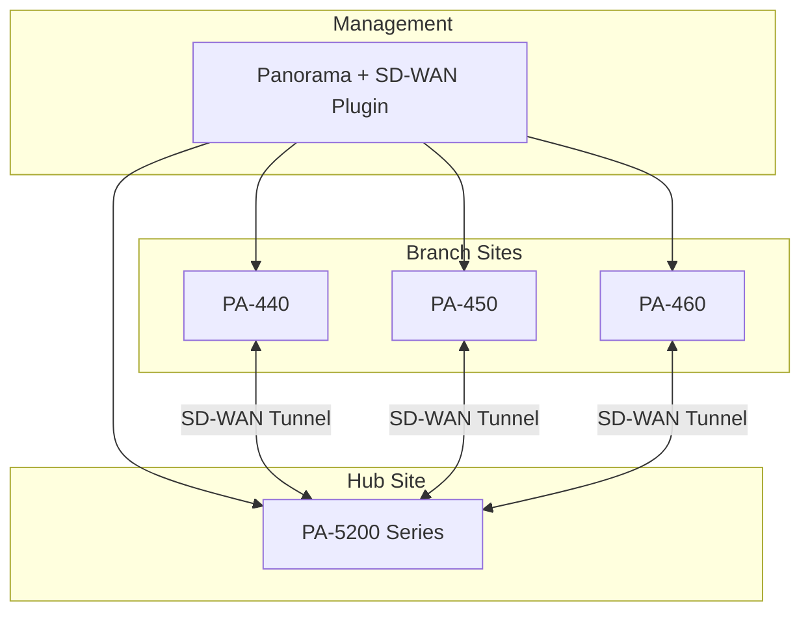

# :material-firewall: PAN-OS SD-WAN Basics

PAN-OS SD-WAN adds software-defined WAN capabilities to existing PA-Series next-generation firewalls through a **Panorama plugin**. This approach lets you add SD-WAN to your existing Palo Alto security infrastructure.

## Architecture

PAN-OS SD-WAN is managed entirely through **Panorama**:



## Supported Hardware

| Model | Throughput | Recommended For |
|-------|-----------|-----------------|
| PA-440 | 3.4 Gbps | Small branch |
| PA-450 | 5.2 Gbps | Medium branch |
| PA-460 | 7.2 Gbps | Large branch |
| PA-3400 Series | 23-48 Gbps | Regional hub |
| PA-5200 Series | 64-100 Gbps | Data center hub |
| PA-7000 Series | 200+ Gbps | Large DC / HQ |
| VM-Series | Varies | Cloud hub |

## Prerequisites

1. **Panorama** running PAN-OS 10.2+ with SD-WAN plugin 3.0+
2. **PA-Series firewalls** with PAN-OS 10.2+ and valid SD-WAN license
3. **Panorama Device Groups** and **Templates** configured
4. Firewalls managed by Panorama

## Install SD-WAN Plugin on Panorama

### Step 1: Download and Install

1. Navigate to **Panorama** > **Plugins**
2. Search for `sd-wan`
3. Download the latest version (3.x)
4. Install the plugin

### Step 2: Configure SD-WAN Settings

In Panorama, navigate to **Panorama** > **SD-WAN** > **SD-WAN Settings**:

- **Hub name** -- Unique identifier for the hub site
- **Hub interfaces** -- WAN interfaces on the hub firewall
- **SD-WAN tunnels** -- Define tunnel parameters

### Step 3: Create SD-WAN Interface Profile

```
Device > SD-WAN Interface Profile
  Name: ISP1-Profile
  Link Type: Ethernet
  Max Download (Mbps): 100
  Max Upload (Mbps): 100
  ISP Name: Comcast
  Path Monitor:
    - Enabled: Yes
    - Interval: 3 seconds
    - Failure Condition: 3 consecutive failures
```

### Step 4: Enable SD-WAN on Interfaces

```
Network > Interfaces > Ethernet
  ethernet1/1:
    Type: Layer 3
    SD-WAN Interface Profile: ISP1-Profile
    
  ethernet1/2:
    Type: Layer 3
    SD-WAN Interface Profile: ISP2-Profile
```

### Step 5: Configure SD-WAN VPN Cluster

```
Panorama > SD-WAN > VPN Clusters
  Name: Corporate-SD-WAN
  Type: Hub-and-Spoke
  Hub:
    - Device Group: DC-Firewalls
    - Template: DC-Template
  Branches:
    - Device Group: Branch-Firewalls
    - Template: Branch-Template
  VPN Settings:
    - IKE Crypto Profile: AES-256-GCM-SHA256
    - IPsec Crypto Profile: AES-256-GCM
```

## SD-WAN Traffic Distribution

PAN-OS SD-WAN uses **Traffic Distribution Profiles** to steer traffic:

```
Panorama > SD-WAN > Traffic Distribution
  Profile: Business-Critical
    Traffic Distribution Method: Best Available Path
    Path Quality Profile: Low-Latency
    
  Profile: Bulk-Transfer
    Traffic Distribution Method: Top Down Priority
    Priority 1: ISP1 (lowest cost)
    Priority 2: ISP2
```

## Verification

```
# Check SD-WAN status on firewall
> show sdwan connection all

# View tunnel status
> show sdwan tunnel all

# Check path quality
> show sdwan path-monitor stats

# View traffic distribution
> show sdwan traffic-distribution

# Debug SD-WAN
> debug sdwan traffic-distribution on
```

## Key Differences from Standalone NGFW

| Feature | Standalone PA | PA with SD-WAN |
|---------|--------------|----------------|
| WAN routing | Static / OSPF / BGP | SD-WAN policy-based |
| Path selection | Manual PBF | Automatic SLA-based |
| Tunnel management | Manual IPsec | Automated VPN mesh |
| QoS | Manual QoS policies | App-aware QoS |
| Monitoring | Basic interface stats | SD-WAN path analytics |

!!! tip "Start with Panorama templates"
    Design your Panorama template stack carefully before deploying SD-WAN. Use template variables for site-specific settings (WAN IPs, gateways) and shared templates for common SD-WAN policies.
