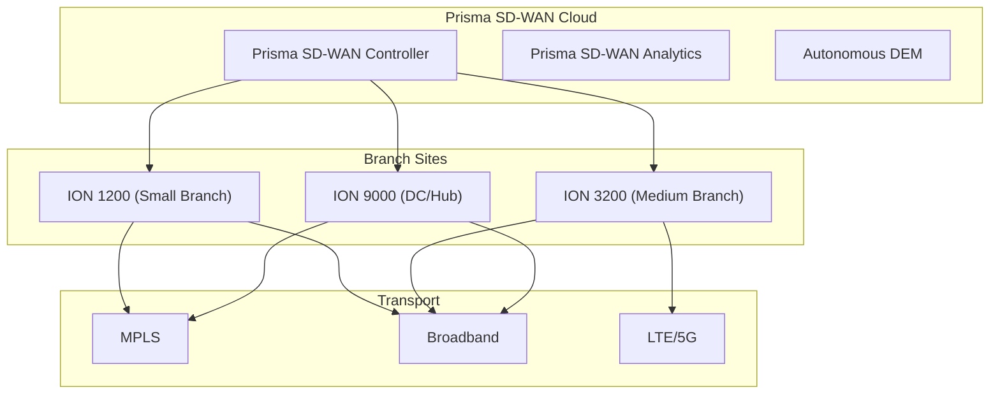

# :material-cloud-outline: Prisma SD-WAN Basics

Prisma SD-WAN (formerly CloudGenix) is Palo Alto Networks' cloud-managed SD-WAN solution. It uses purpose-built **ION** (Instant-On Network) appliances managed by a centralized cloud controller.

## Architecture



## ION Device Family

| Model | Throughput | WAN Ports | Use Case |
|-------|-----------|-----------|----------|
| ION 1200 | 500 Mbps | 2 | Small branch (5-50 users) |
| ION 1200-S | 200 Mbps | 2 | Micro branch / retail |
| ION 3200 | 2 Gbps | 4 | Medium branch (50-200 users) |
| ION 5200 | 5 Gbps | 6 | Large branch / regional hub |
| ION 9000 | 10+ Gbps | 8 | Data center / hub |
| ION vEdge | Varies | Virtual | Cloud (AWS, Azure, GCP) |

## Key Concepts

### Application-First Approach

Prisma SD-WAN uses **AppFabric** technology to identify and classify applications:

- Application identification without DPI (flow metadata + ML)
- Automatic path selection per application
- Built-in application SLA definitions
- No need for manual application policies in most cases

### Instant-On Network (ION)

ION devices are designed for zero-touch deployment:

1. **Claim device** in the Prisma SD-WAN portal (serial number)
2. **Assign to site** with predefined policies
3. **Ship to site** -- non-technical staff plugs in power and WAN
4. **Auto-configures** -- device pulls config from cloud controller
5. **Operational** in minutes

### VPN-Less Architecture

Unlike traditional SD-WAN, Prisma SD-WAN can operate **without IPsec tunnels** for certain traffic:

- Uses application-aware path selection on native underlay
- IPsec tunnels only where encryption is required
- Reduces overhead and improves performance
- Full encryption available when needed

## Initial Setup

### Claiming a Device

In the Prisma SD-WAN portal:

1. Navigate to **Inventory** > **Devices**
2. Click **Claim** and enter the device serial number
3. Assign the device to a **Site**
4. The device will auto-provision on next boot

### Site Configuration (API)

Prisma SD-WAN is API-first. Site creation via API:

```python
import prisma_sase

# Initialize SDK
sdk = prisma_sase.API()
sdk.interactive.login()

# Create a site
site_data = {
    "name": "Branch-NYC-001",
    "description": "New York City Branch Office",
    "address": {
        "street": "123 Main St",
        "city": "New York",
        "state": "NY",
        "country": "US"
    },
    "location": {
        "latitude": 40.7128,
        "longitude": -74.0060
    },
    "policy_set_id": "default-policy-set-id",
    "element_cluster_role": "SPOKE",
    "admin_state": "active"
}

response = sdk.post.sites(site_data)
print(f"Site created: {response.json()['id']}")
```

### WAN Interface Configuration (API)

```python
# Configure WAN interface on ION device
wan_interface = {
    "name": "WAN 1",
    "type": "wan",
    "admin_state": "enabled",
    "mtu": 1500,
    "addresses": [
        {
            "address_type": "dhcp"
        }
    ],
    "label_id": "public-internet-label-id",
    "bw_config": {
        "uplink_bw": 100,      # Mbps
        "downlink_bw": 100     # Mbps
    }
}

response = sdk.post.interfaces(site_id, element_id, wan_interface)
```

## Prisma SD-WAN vs Traditional SD-WAN

| Feature | Prisma SD-WAN | Traditional SD-WAN |
|---------|--------------|-------------------|
| Management | Cloud-native | On-prem or hybrid |
| Tunnels | Optional (VPN-less capable) | Always-on IPsec |
| App identification | ML-based, automatic | DPI-based, manual rules |
| API coverage | 100% API-first | Varies by vendor |
| Deployment | Claim & ship | Pre-stage or ZTP |

!!! info "CloudGenix SDK"
    Prisma SD-WAN has a comprehensive Python SDK (`prisma_sase`) for full automation. Every operation available in the portal can be done via API.
