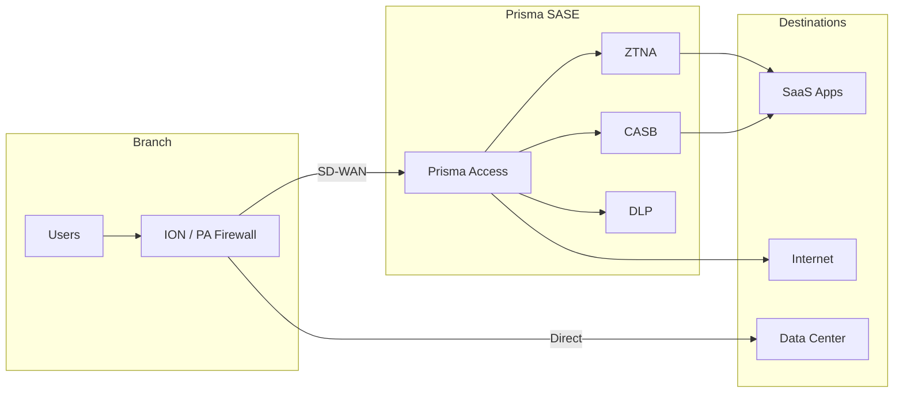

# :material-shield-lock: Security Integration

A key advantage of Palo Alto SD-WAN is deep integration with their security ecosystem -- NGFW, Prisma Access, and the full SASE framework.

## PAN-OS SD-WAN + NGFW

Since SD-WAN runs directly on the PA-Series firewall, you get native NGFW security:

### Security Policy for SD-WAN Traffic

```
Policies > Security > Security Policy
  Rule: Allow-Branch-to-DC
    Source Zone: SD-WAN
    Destination Zone: Trust
    Application: any
    Action: Allow
    Security Profiles:
      Antivirus: Default
      Anti-Spyware: Strict
      Vulnerability: Strict
      URL Filtering: Corporate
      File Blocking: Strict
      WildFire: Default

  Rule: Direct-Internet-Breakout
    Source Zone: Trust
    Destination Zone: SD-WAN (Internet)
    Application: ssl, web-browsing, ms-office365-base
    Action: Allow
    Security Profiles:
      Antivirus: Default
      Anti-Spyware: Strict
      URL Filtering: Corporate
      WildFire: Default
```

### Decryption for SD-WAN Traffic

```
Policies > Decryption
  Rule: Inspect-SaaS
    Source Zone: Trust
    Destination Zone: Untrust
    Application: ssl
    Action: Decrypt (SSL Forward Proxy)
    Decryption Profile: Recommended
```

## Prisma SD-WAN + Prisma Access

### Service Connection

Connect Prisma SD-WAN to Prisma Access for cloud-delivered security:

```python
service_connection = {
    "name": "Prisma-Access-Link",
    "type": "prisma_access",
    "admin_state": "enabled",
    "site_id": "<hub-site-id>",
    "prisma_access_config": {
        "region": "us-east-1",
        "bandwidth_allocation": 500,  # Mbps
        "bgp_peer": {
            "local_as": 65000,
            "remote_as": 65534,
            "peer_ip": "169.254.100.1"
        }
    }
}

sdk.post.prismaaccess_configs(service_connection)
```

### Traffic Steering to Prisma Access

```python
# Steer internet-bound traffic to Prisma Access for inspection
internet_policy = {
    "name": "Internet-via-PrismaAccess",
    "app_def_ids": ["<internet-apps>"],
    "paths_allowed": {
        "active_paths": [
            {
                "label": "prisma-access",
                "path_type": "servicelink"
            }
        ]
    }
}
```

## SASE Architecture



## Security Features Comparison

| Feature | PAN-OS SD-WAN | Prisma SD-WAN |
|---------|--------------|---------------|
| NGFW | Native (on-box) | Via Prisma Access (cloud) |
| IPS/IDS | Native | Via Prisma Access |
| URL Filtering | Native | Via Prisma Access |
| Sandboxing | WildFire | WildFire (cloud) |
| CASB | Via Prisma Access | Via Prisma Access |
| DLP | Via Prisma Access | Via Prisma Access |
| ZTNA | GlobalProtect + Prisma | Prisma Access native |

!!! tip "Secure by default"
    PAN-OS SD-WAN has a distinct advantage: every SD-WAN path goes through the NGFW pipeline. No additional integration needed -- security policies apply to all SD-WAN traffic automatically.
