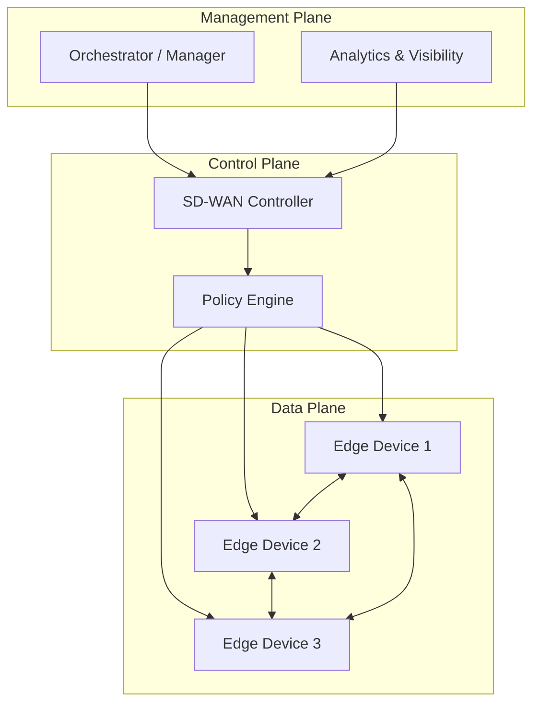

# :material-layers-triple: SD-WAN Architecture

SD-WAN architecture separates network functionality into three distinct planes, following Software-Defined Networking (SDN) principles applied to the WAN.

## The Three Planes

### Management Plane

The management plane provides the **single pane of glass** for administrators:

- **Orchestrator** -- Centralized configuration, template management, firmware updates
- **Analytics** -- Real-time and historical visibility into application performance, link health, and security events
- **API access** -- REST APIs for automation and integration with external systems (ITSM, SIEM)

### Control Plane

The control plane makes intelligent decisions about traffic:

- **Policy engine** -- Defines how applications are routed based on business intent
- **Topology management** -- Maintains awareness of all sites, links, and their health
- **Route computation** -- Calculates optimal paths considering real-time metrics
- **Key management** -- Distributes encryption keys for IPsec tunnels

### Data Plane

The data plane handles the actual packet forwarding:

- **Edge devices** -- FortiGate, vEdge, or other CPE at each site
- **Overlay tunnels** -- IPsec/GRE tunnels over any transport
- **DPI engine** -- Application identification and classification
- **QoS enforcement** -- Traffic shaping, prioritization, and policing

## Deployment Models

### Hub-and-Spoke

The most common model for enterprises with a central data center:

- All branches connect to one or more hubs
- Hub provides shared services (internet, security, DC resources)
- Branches can communicate via hub or direct spoke-to-spoke tunnels

### Full Mesh

Every site connects directly to every other site:

- Lowest latency for site-to-site traffic
- Higher tunnel count and complexity
- Best for environments where inter-branch communication is frequent

### Partial Mesh / Hybrid

A combination approach:

- Hub-and-spoke for primary topology
- Dynamic spoke-to-spoke tunnels on demand (e.g., Fortinet ADVPN)
- Best balance of simplicity and performance

!!! info "Vendor variations"
    Each SD-WAN vendor implements these planes differently. For example, Fortinet integrates the control plane directly into each FortiGate (distributed control), while some vendors use a separate centralized controller. See [Implementations](../implementations/index.md) for vendor-specific details.
