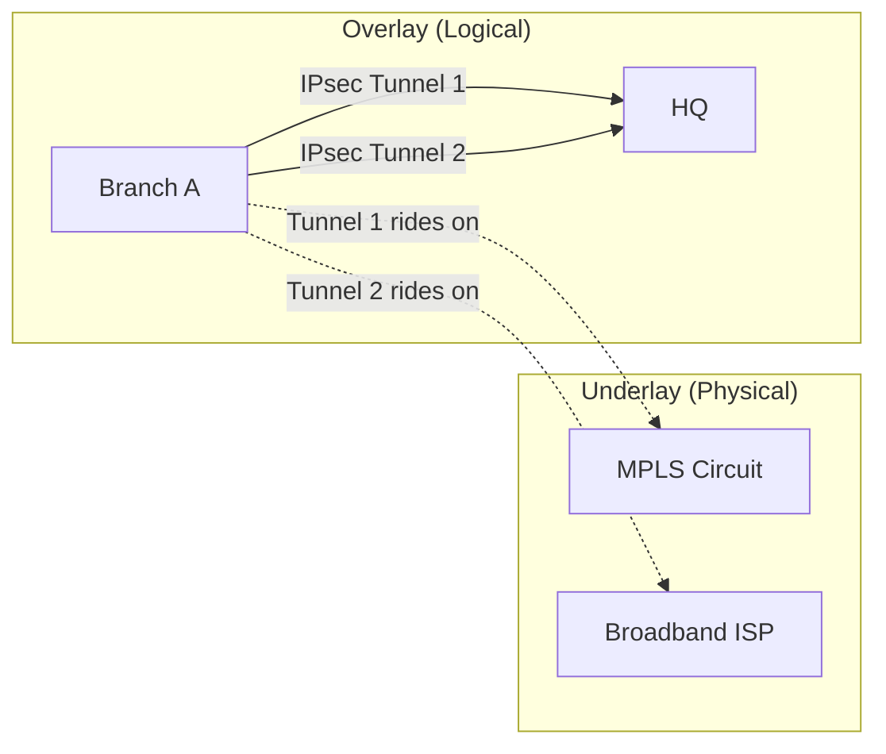

# :material-layers: Overlay vs Underlay

SD-WAN fundamentally depends on the separation between the **overlay** (virtual, software-defined) and the **underlay** (physical transport). Understanding this distinction is key to designing and troubleshooting SD-WAN.

## Underlay Network

The underlay is the physical transport that carries SD-WAN traffic:

| Transport | Typical Use | Pros | Cons |
|-----------|------------|------|------|
| MPLS | Primary WAN for critical apps | Reliable, SLA-backed, QoS | Expensive, slow to provision |
| Broadband | Cost-effective alternative | Cheap, widely available | Best-effort, variable quality |
| LTE/5G | Backup or remote sites | Fast deployment, mobile | Data caps, shared medium |
| Satellite | Remote/maritime locations | Global coverage | High latency, expensive |

## Overlay Network

The overlay is the virtual network created by SD-WAN on top of the underlay:

- **IPsec tunnels** encrypt all traffic between SD-WAN edge devices
- **Application policies** determine which overlay path traffic takes
- **Health monitoring** tracks the real-time quality of each underlay link
- **Dynamic failover** moves traffic between underlays based on SLA thresholds

## Key Concepts

### Tunnel Aggregation

SD-WAN can bond multiple underlay links into a single logical connection, providing:

- **Increased bandwidth** -- Aggregate throughput of all links
- **Seamless failover** -- Sub-second switchover between links
- **Load balancing** -- Distribute sessions across links

### Per-Packet vs Per-Session Steering

- **Per-session** -- Each new session is assigned to a path; simpler, avoids reordering
- **Per-packet** -- Individual packets can take different paths; maximizes bandwidth but requires sequence handling

### Overlay Routing

SD-WAN overlays use their own routing protocols or proprietary mechanisms:

- Static routes injected by the controller
- BGP or OSPF over overlay tunnels
- Proprietary route exchange (vendor-specific)

!!! warning "MTU considerations"
    Overlay encapsulation (IPsec + tunneling headers) reduces the effective MTU. Ensure you account for ~58-100 bytes of overhead to avoid fragmentation issues. Most SD-WAN vendors handle this automatically with PMTUD or TCP MSS clamping.
