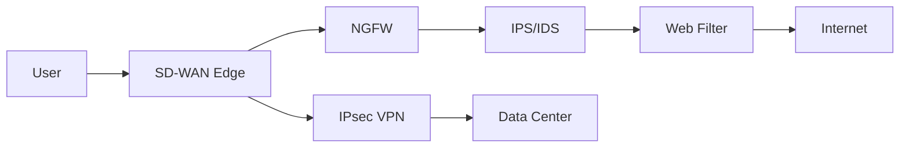

# :material-shield-lock: SD-WAN Security

Modern SD-WAN solutions integrate security directly into the WAN edge, eliminating the need to backhaul all traffic through a centralized security stack.

## Security Components

### Next-Generation Firewall (NGFW)

Integrated firewall capabilities at every SD-WAN edge:

- Stateful packet inspection
- Application control and filtering
- User/group-based policies
- Geo-IP blocking

### Intrusion Prevention System (IPS)

- Real-time threat detection and prevention
- Signature-based and behavioral analysis
- Protection against known exploits and zero-days

### Web Filtering

- URL categorization and filtering
- SSL/TLS inspection for encrypted traffic
- Safe search enforcement
- Botnet C&C blocking

### Sandboxing

- Analyze suspicious files in an isolated environment
- Detect zero-day malware
- Cloud-based or on-premises sandboxing

## Security Architecture

## Direct Internet Access (DIA)

SD-WAN enables secure local internet breakout at each branch:

- SaaS traffic goes direct to the internet without backhauling
- Full security stack applied locally at the edge
- Reduces latency and data center load
- Requires robust security at every branch

!!! warning "Security is non-negotiable"
    When enabling direct internet access, ensure every branch has a full security stack (NGFW, IPS, web filtering) applied. Without this, you're exposing branches directly to internet threats.
