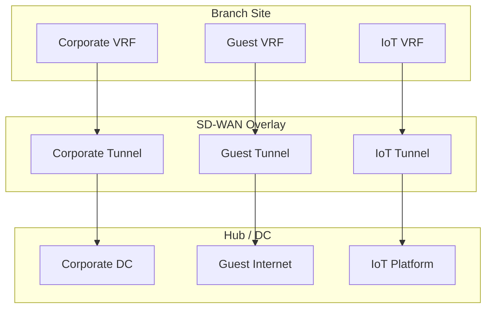

# :material-vector-polygon: Segmentation & VRF

Network segmentation in SD-WAN isolates traffic into separate virtual networks, improving security and enabling compliance with regulatory requirements.

## Why Segment?

- **Security** -- Contain lateral movement if a segment is compromised
- **Compliance** -- PCI DSS, HIPAA, and other frameworks require network isolation
- **Multi-tenancy** -- Service providers can offer isolated services per customer
- **Traffic management** -- Different policies per segment

## VRF (Virtual Routing and Forwarding)

VRFs create isolated routing tables on a single device:

- Each VRF has its own routing table, interfaces, and policies
- Traffic cannot cross VRF boundaries without explicit policy (inter-VRF routing)
- VRFs extend across the SD-WAN overlay via separate tunnels or VXLAN

## SD-WAN Segmentation Design

## Implementation Approaches

| Approach | Isolation Level | Complexity |
|----------|----------------|------------|
| VLAN-based | L2 isolation | Low |
| VRF (L3) | Full routing isolation | Medium |
| SD-WAN Zones | Policy-based isolation | Low-Medium |
| VXLAN + VRF | L2 + L3 overlay isolation | High |

!!! info "Fortinet SD-WAN Zones"
    Fortinet implements segmentation through SD-WAN Zones combined with VDOMs (Virtual Domains) for multi-tenant deployments. See [Fortinet SD-WAN Zones](../implementations/fortinet/sdwan-zones.md).
