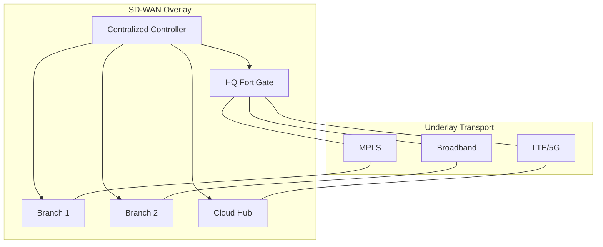

# :material-help-circle: What is SD-WAN?

**SD-WAN (Software-Defined Wide Area Networking)** is a technology that applies software-defined networking (SDN) principles to the wide area network. It abstracts the WAN control plane from the underlying transport, enabling centralized management, application-aware routing, and dynamic path selection across multiple connection types.

## The Problem SD-WAN Solves

Traditional enterprise WANs rely heavily on **MPLS** circuits for site-to-site connectivity. While MPLS provides reliable, low-latency transport with built-in QoS, it comes with significant drawbacks:

- **High cost** -- MPLS circuits are expensive, especially for international links
- **Long provisioning times** -- Weeks or months to deploy a new site
- **Rigid architecture** -- Static routing, no application awareness
- **Backhauling** -- Cloud and SaaS traffic routed through the data center
- **Limited bandwidth** -- Costly to scale as traffic demands grow

SD-WAN addresses all of these challenges.

## How SD-WAN Works

SD-WAN creates a virtualized overlay on top of any combination of transport services:

### Key Components

1. **SD-WAN Edge Devices** -- Hardware or virtual appliances deployed at each site (branch, data center, cloud)
2. **Centralized Controller / Orchestrator** -- Manages policies, configurations, and traffic steering rules across all sites
3. **Overlay Network** -- Encrypted tunnels (typically IPsec) formed between SD-WAN edge devices over any transport
4. **Application-Aware Routing** -- Deep packet inspection (DPI) identifies applications and steers traffic based on defined policies

## Core Capabilities

### Application-Aware Routing

SD-WAN identifies applications using DPI and routes them according to business policies:

- **Critical apps** (VoIP, video) get the best available path
- **SaaS apps** (Microsoft 365, Salesforce) go direct-to-internet
- **Bulk traffic** (backups, updates) uses lower-cost links

### Dynamic Path Selection

Real-time monitoring of link health (latency, jitter, packet loss) enables automatic failover:

| Metric | Threshold Example | Action |
|--------|-------------------|--------|
| Latency | > 150ms | Switch to backup path |
| Jitter | > 30ms | Move voice traffic |
| Packet Loss | > 1% | Failover critical apps |

### Centralized Management

A single management console provides:

- Zero-touch provisioning for new sites
- Template-based policy deployment
- Real-time visibility and analytics
- Firmware management and upgrades

### Built-in Security

Modern SD-WAN solutions include:

- **IPsec encryption** on all overlay tunnels
- **Next-generation firewall** (NGFW) capabilities
- **IPS/IDS** -- Intrusion prevention and detection
- **URL filtering** and web security
- **Segmentation** using VRFs for traffic isolation

## SD-WAN Benefits

| Benefit | Description |
|---------|-------------|
| Cost savings | 30-60% reduction vs. MPLS-only WANs |
| Agility | Deploy new sites in minutes with ZTP |
| Performance | Application-aware steering improves user experience |
| Security | Integrated security stack at every edge |
| Cloud-ready | Direct cloud on-ramp for SaaS and IaaS |
| Resilience | Active-active across multiple transports |

## Who Uses SD-WAN?

SD-WAN is deployed across virtually every industry:

- **Retail** -- Thousands of distributed stores
- **Healthcare** -- Clinics, hospitals, and telehealth
- **Financial services** -- Branches with strict compliance
- **Manufacturing** -- Factories with IoT and OT networks
- **Education** -- Campus and remote learning

!!! tip "Next steps"
    - [SD-WAN Architecture](architecture.md) -- Deep dive into the control, data, and management planes
    - [SD-WAN vs Traditional WAN](sdwan-vs-traditional.md) -- Detailed comparison
    - [Fortinet SD-WAN Basics](../implementations/fortinet/sdwan-basics.md) -- Start configuring
