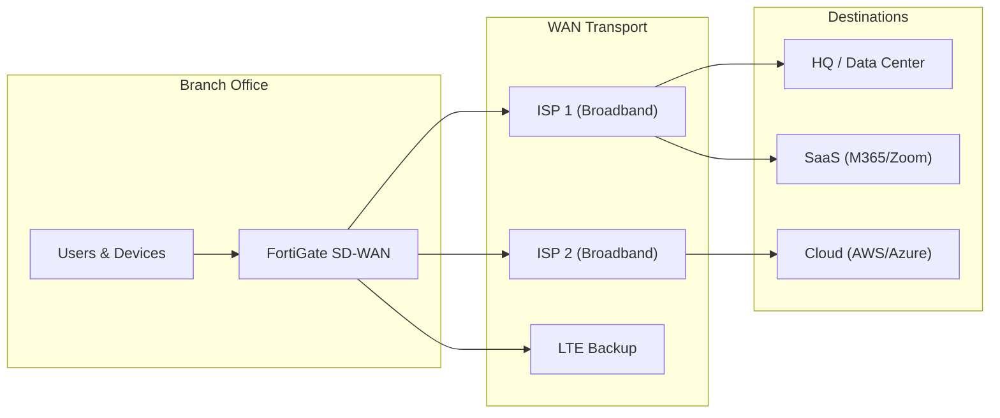

# :material-office-building: Branch Office Connectivity

The most common SD-WAN use case: connecting branch offices to headquarters, data centers, and cloud resources with optimized, secure, and cost-effective WAN connectivity.

## The Challenge

Traditional branch WAN connectivity relies on MPLS circuits that are:

- Expensive to deploy and maintain
- Slow to provision (weeks to months)
- Limited in bandwidth
- Not optimized for cloud/SaaS applications

## SD-WAN Solution

### Typical Branch Design

### Key Design Elements

1. **Dual ISP** at each branch for redundancy
2. **LTE backup** for last-resort connectivity
3. **Local internet breakout** for SaaS applications
4. **Full security stack** at every branch (NGFW, IPS, web filtering)
5. **Zero-touch provisioning** for rapid site deployment
6. **Centralized management** via FortiManager

## Benefits

| Metric | MPLS-Only | SD-WAN |
|--------|-----------|--------|
| Monthly cost per site | $800-2000 | $200-500 |
| Deployment time | 4-8 weeks | 1-2 days |
| Bandwidth | 10-50 Mbps | 100-500 Mbps |
| Cloud access | Backhauled | Direct |
| Security | Centralized only | Distributed |

!!! example "Real-world scenario"
    A retail chain with 500 branches replaced MPLS with dual-broadband SD-WAN. Result: 60% cost reduction, 5x bandwidth increase, and SaaS performance improvement from 400ms to 50ms latency for Microsoft 365.
